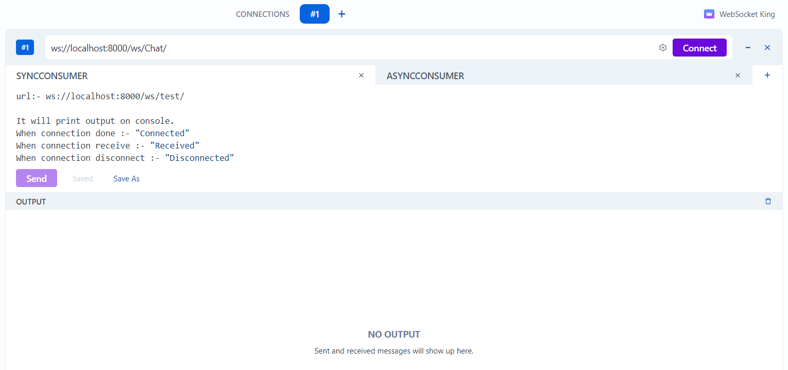

# Django-Channels

Channels is a project that takes Django and extends its abilities beyond HTTP - to handle WebSockets, chat protocols, IoT protocols, and more. It’s built on a Python specification called ASGI.

<!-- ABOUT THE PROJECT -->
## About The Project




### Built With

* [Python](https://www.python.org/)
  
* [Django](https://www.djangoproject.com/start/overview/)


### Installation

1. Clone the repo
   ```sh
   git clone https://github.com/prettyquail/Django-Channels.git
   ```
2. activate virtualenv
3. install requirements.txt file
4. Use WebSocket King and hit the url "ws://localhost:8000/ws/Chat/"
